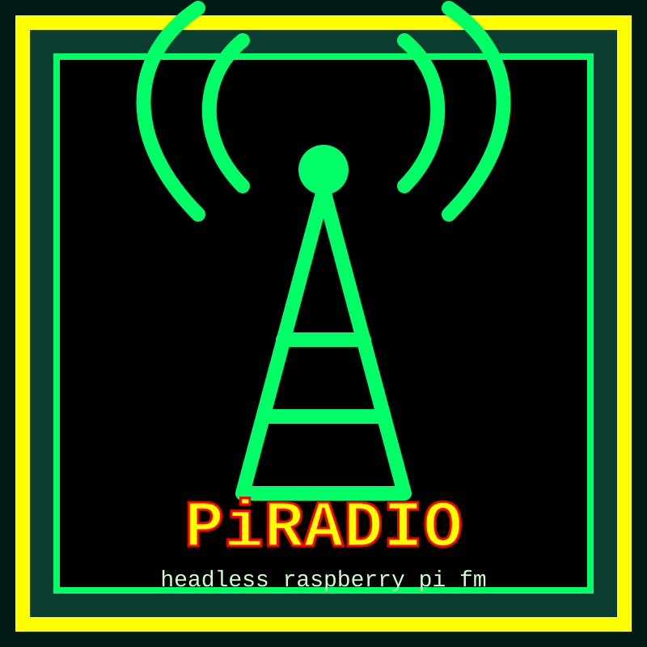

  

<h1 align="center">PiRadio</h1>

  <strong>Raspberry Pi FM radio project</strong>

`piradio` is a recovered and modernized Raspberry Pi FM radio project. It installs a headless radio service that starts automatically on boot, decodes music and announcement audio with `ffmpeg`, and pipes raw audio into `pifm` for FM transmission.

The goal is to make an old working Raspberry Pi Pirate Radio setup reproducible on modern Raspberry Pi systems with a one-command installer, systemd service setup, diagnostics, and friendly configuration tools.

## Project status

This project is currently in early public-release preparation.

Working so far:

- recovered original code and service layout
- one-command installer
- systemd service installation
- Raspberry Pi OS / Debian Bookworm aarch64 service startup after installing `armhf` runtime libraries
- diagnostic script
- compatibility documentation

Still to confirm:

- actual RF output on a receiver
- final license status of recovered upstream components
- broader Raspberry Pi model compatibility

See:

- `NOTICE.md`
- `docs/rf-safety.md`
- `docs/compatibility.md`
- `docs/publication-checklist.md`

## Quick install

Recommended target:

- Raspberry Pi OS Lite, 32-bit
- Raspberry Pi Zero / Zero W / Zero 2 W / Pi 1 / Pi 2 / Pi 3 / Pi 4
- SSH enabled
- Network access during install

On the Raspberry Pi:

    sudo apt update
    sudo apt install -y git
    git clone https://github.com/nialljmiller/piradio.git
    cd piradio
    sudo ./install.sh

The installer will:

- install runtime dependencies
- install `PirateRadio.py`
- install the recovered `pifm` binary
- create `/pirateradio`
- create `/pirateradio/pirateradio.config`
- create demo audio if no audio exists yet
- install and enable `pirateradio.service`
- start the radio service

Check status:

    sudo systemctl status pirateradio.service

Follow logs:

    sudo journalctl -u pirateradio.service -f

Run diagnostics:

    sudo ./scripts/piradio_doctor.sh

## Adding music

Songs go directly in:

    /pirateradio

Announcement clips go in:

    /pirateradio/announce

The installer creates demo audio only so a fresh installation can start immediately. Replace the demo files with your own music and announcements.

## Configuration wizard

Run the interactive configuration wizard from the repo:

    sudo ./scripts/configure_piradio.sh

The wizard lets you set:

- FM frequency
- shuffle on/off
- repeat forever on/off
- stereo playback on/off

It backs up the old config before writing a new one and can restart the radio service for you.

## Configuration

Edit:

    sudo nano /pirateradio/pirateradio.config

Example:

    [pirateradio]
    frequency = 101.1
    shuffle = False
    repeat_all = True
    stereo_playback = True

Restart after changing config:

    sudo systemctl restart pirateradio.service

## Compatibility

| Platform | Status | Notes |
|---|---:|---|
| Original recovered Arch Linux ARM image | Known working | This is where the recovered setup came from. |
| Raspberry Pi OS Lite 32-bit | Primary target | Recommended fresh-install target. |
| Raspberry Pi OS Desktop 32-bit | Likely | Should work, but Lite is preferred for a headless radio. |
| Raspberry Pi OS 64-bit / Debian Bookworm aarch64 | Tested to start service | Installer adds the required `armhf` runtime for the recovered 32-bit `pifm` binary. RF output still needs receiver confirmation. |
| Ubuntu Server 32-bit ARM | Maybe | Not the main target; package names and `pifm` compatibility may differ. |
| Ubuntu Server 64-bit ARM | Not recommended | Same 32-bit `pifm` issue, plus more distro variation. |
| Alpine / DietPi / LibreELEC / RetroPie / other appliance OSes | Unsupported | May work with manual changes, but the installer is not designed for them. |
| Raspberry Pi Pico / Pico W | Not supported | Pico boards do not run normal Linux/systemd. |

## Raspberry Pi model compatibility

| Model | Status | Notes |
|---|---:|---|
| Raspberry Pi 1 | Yes (Tested) | Close to the era of the recovered setup. Use 32-bit OS. |
| Raspberry Pi Zero / Zero W | Yes (Tested) | Good target for a headless radio. Use 32-bit OS. |
| Raspberry Pi Zero 2 W | Likely | Good target. Use 32-bit OS first. |
| Raspberry Pi 2 | Likely | Use 32-bit OS first. |
| Raspberry Pi 3 / 3B / 3B+ | Likely | Use 32-bit OS first. |
| Raspberry Pi 4 | Maybe | Likely at the Linux level, but `pifm` hardware behavior needs testing. |
| Raspberry Pi 5 | Unknown / not recommended yet | Pi 5 hardware differs enough that the recovered `pifm` binary should not be assumed to work. |

## Important note

This project uses FM transmission. Check your local rules before attaching an antenna or transmitting beyond a tiny test range.
